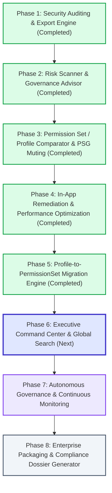

# Production Roadmap: Salesforce Permissions & Security Governance Suite

## Executive Vision

Transform the Salesforce Permissions Application from an internal utility into an **enterprise-grade, production-ready Security, Auditing, Governance, and Migration Suite**. The application enables Salesforce Administrators, Security Analysts, and Compliance Auditors to inspect, compare, audit, analyze, remediate, and migrate permissions and record-level access across any Salesforce org.

---

## Phased Release Schedule

---

## Phase 1: Security Auditing ("Who Has Access?") & Universal Export Engine [COMPLETED]

### Status: Complete & Deployed

- **Apex**: `WhoHasAccessController.cls`, `WhoHasAccessControllerTest.cls` (100% test pass)
- **LWC**: `c/whoHasAccess`, `c/csvExportUtil`
- **Metadata**: Custom Tab `Who_Has_Access`, FlexiPage `Who_Has_Access`

### Key Capabilities Delivered:

1. **Reverse Permission Lookup**:
   - Query users holding permissions across Object CRUD & FLS, System Permissions, Apex Classes, Visualforce Pages, and Flow Execution.
   - Comprehensive origin tracking (Profile vs Permission Set vs Permission Set Group).
2. **Universal RFC 4180 CSV Export**:
   - Client-side UTF-8 BOM encoding for seamless Excel compatibility.
   - Audit-ready export on Who Has Access and effective permissions.

---

## Phase 2: Security Health, Risk Scanner & Governance Advisor [COMPLETED]

### Status: Complete & Deployed

- **Apex**: `SecurityAdvisorController.cls`, `SecurityAdvisorControllerTest.cls` (100% test pass, 94% coverage)
- **LWC**: `c/securityAdvisor` (Executive score gauge, KPI metric cards, tabs, affected user modal, CSV export)
- **Metadata**: Custom Tab `Security_Advisor`, FlexiPage `Security_Advisor`, `Permissions_App`, `Permission_App`

### Key Capabilities Delivered:

1. **0–100 Executive Health Score**: Weighted scoring reflecting privilege sprawl, non-admin elevated access, and dormant configurations.
2. **Critical Privilege Scanner**: Identifies non-admin users holding critical system permissions (`ModifyAllData`, `ViewAllData`, `AuthorApex`, `CustomizeApplication`, etc.).
3. **Hygiene & Redundancy Detection**: Tracks dormant permission sets (0 active users), inactive users holding permission sets, and redundant admin assignments.

---

## Phase 3: Permission Set & Profile Comparator & PSG Muting Inspector [COMPLETED]

### Status: Complete & Deployed

- **Apex**: `PermissionComparatorController.cls`, `PermissionComparatorControllerTest.cls` (100% test pass)
- **LWC**: `c/permissionComparator` (Dual entity comparison, diff badges, PSG & muting inspector, CSV export)
- **Metadata**: Custom Tab `Permission_Comparator`, FlexiPage `Permission_Comparator`, `Permissions_App`, `Permission_App`

### Key Capabilities Delivered:

1. **Dual Entity Permission Comparator**:
   - Side-by-side comparison across Profile vs Profile, Profile vs PS, PS vs PS, PSG vs PSG.
   - Dynamic diff filtering (Differences Only, Left Only, Right Only, Identical).
2. **Permission Set Group (PSG) & Muting Inspector**:
   - Detailed inspection of constituent permission sets inside PSGs.
   - Explicit visualization of Muting Permission Set effects.
3. **Comparison Matrix CSV Export**: One-click export of comparison diffs for migration planning.

---

## Phase 4: In-App Remediation & Performance Optimization [COMPLETED]

### Status: Complete & Deployed

- **Apex**:
  - `DescribeCacheService.cls`: Multi-tier Platform Cache (`local.PermissionsPartition`) with transaction in-memory fallback.
  - `RecordAccessController.cls`: `grantManualShare`, `revokeManualShare`, setup user and record deep-links, cached searchable sObjects.
  - `SecurityAdvisorController.cls`: `remediateInactiveUserAssignments`, `remediateRedundantAssignment`.
  - `SetupAuditTrailController.cls`: `getRecentSecurityAuditTrails`, `getAuditTrailSections`.
  - `RecordAccessControllerTest.cls`, `SecurityAdvisorControllerTest.cls`, `SetupAuditTrailControllerTest.cls` (18/18 tests passing, 100% pass rate).
- **LWC**:
  - `c/recordAccess`: In-table search, configurable pagination (5/10/25/50), Grant Share modal, Revoke Share action, CSV matrix export, User Setup & Record View deep links.
  - `c/securityAdvisor`: Bulk and single-click removal of inactive user assignments and redundant admin permission sets, Setup Audit Trail (7 Days) tab with filtering and CSV export.

### Key Capabilities Delivered:

1. **Direct Record Access Remediation**: Grant manual Read/Edit shares and revoke explicit shares with 1 click.
2. **High-Volume Pagination & Platform Caching**: Resilient multi-tier describe cache and paginated record matrix.
3. **Security Hygiene Remediation**: Bulk deletion of inactive user permission set assignments and redundant admin assignments.
4. **Setup Audit Trail Inspector**: 7-day security audit trail inspection with section filtering and CSV export.

---

## Phase 5: Profile-to-PermissionSet Migration Engine ("Profile Unbundler & EOL Transition") [COMPLETED]

### Status: Complete & Deployed

- **Apex**: `ProfileMigrationController.cls`, `ProfileMigrationControllerTest.cls` (10/10 tests pass, 86% coverage)
- **LWC**: `c/profileMigration` (3-step wizard, capability breakdown, generator, pre-flight simulator, rollback)
- **Metadata**: Custom Tab `Profile_Migration`, FlexiPage `Profile_Migration`, `Permissions_App`

### Objectives

Provide automated tooling to execute Salesforce's Profile Permissions Retirement roadmap. Empower administrators to extract permissions from legacy monolithic profiles and convert them into modular, reusable Permission Sets and Permission Set Groups with zero downtime.

### Key Deliverables:

1. **Profile Deconstruction & Analysis Engine**:
   - Interactive breakdown of any legacy profile into distinct capability blocks (e.g. Sales CRUD, Support FLS, Admin System Permissions).
   - Automated identification of baseline Standard User permissions vs unique custom permissions.
2. **1-Click Permission Set / PSG Generator**:
   - Automated creation of new custom Permission Sets (`PermissionSet`) and Permission Set Groups (`PermissionSetGroup`) directly from selected profile capabilities.
   - Smart naming conventions and metadata description generation.
3. **Safe User Assignment Migration Wizard**:
   - Dry-run simulation: Calculates the exact difference in user access before applying changes.
   - Zero-Downtime Migration: Assigns new Permission Sets to users holding the profile before stripping profile permissions.
   - 1-Click Rollback protection in case unintended permission loss is detected.

---

## Phase 6: Executive Command Center, Global Search & Cross-Tab Cockpit

### Objectives

Consolidate all seven application tabs into a unified, high-impact Executive Command Center and introduce universal deep-linking and search.

### Key Deliverables:

1. **Modernized Executive Command Center (`Dashboard`)**:
   - Replace the legacy tab container with an executive mission-control dashboard.
   - Real-time posture dial (Health Score), high-risk privilege counters, 7-day setup audit modification timeline, and quick-launch action shortcuts.
2. **Global Omnibox Search**:
   - Top-level instant universal search bar: search across Users, Profiles, Permission Sets, PSGs, Objects, and Fields from any page.
3. **Cross-Component Deep Linking**:
   - Click a user anywhere (in Who Has Access or Security Advisor) to jump directly into Compare User or Record Access for that user.
   - Click a dormant set in Security Advisor to immediately view its contents in Permission Comparator.

---

## Phase 7: Autonomous Security Governance & Continuous Compliance Monitoring

### Objectives

Transition from on-demand admin scans to continuous, automated compliance monitoring and proactive security guardrails.

### Key Deliverables:

1. **Scheduled Compliance Audit Engine (`SecurityGovernanceScheduler.cls`)**:
   - Nightly/weekly scheduled Apex batch job that recalculates org health scores and logs historical snapshots.
   - Posture trend analysis: 7-day, 30-day, and 90-day risk progress graphs.
2. **Real-Time Privilege Escalation Alerts**:
   - Automated alerts (Custom Notifications, Chatter, or Email) triggered when high-risk permissions (`ModifyAllData`, `AuthorApex`, etc.) are assigned to non-admin accounts.
3. **Custom Security Guardrails & Policy Rules**:
   - Configurable rules engine (e.g. _"Non-admin users cannot be granted Export Report"_, _"Permission sets with 0 assignments for >60 days flag for deprecation"_).

---

## Phase 8: Enterprise Packaging, Hardening & Compliance Dossier Generator

### Objectives

Package the application for enterprise multi-org distribution (AppExchange / 2GP Unlocked Package) and generate formal compliance audit dossiers.

### Key Deliverables:

1. **Role-Based Security Hardening**:
   - Modular permission sets: `Permissions_App_Admin` (Full access + remediation) and `Permissions_App_Auditor` (Read-only inspection & export).
2. **Comprehensive Audit Dossier Generator**:
   - One-click generation of formal compliance evidence packages (SOC 2, ISO 27001, SOX, HIPAA).
   - Bundles User Access Reviews, Inactive User Cleanups, Object/FLS Matrices, and Setup Audit Trails into structured multi-sheet workbooks.
3. **Unlocked / 2GP Package Readiness**:
   - Namespace validation, dependency mapping, and automated release pipeline integration via GitHub Actions / Salesforce CLI.

---

## Implementation Standards & Production Requirements

- **Strictly No Jest**: All automated verification performed via Apex test classes in the target Salesforce org with >= 85% coverage.
- **Apex Security & Robustness**: Proper parameterized SOQL, CRUD/FLS validation where appropriate, and multi-tier exception handling.
- **SLDS Modern Design**: Responsive grid layouts, high-contrast badges, accessible color contrasts, and SLDS design tokens.
- **Continuous Version Control**: Clean atomic git commits with pre-commit ESLint, Prettier, and lint-staged validation.
