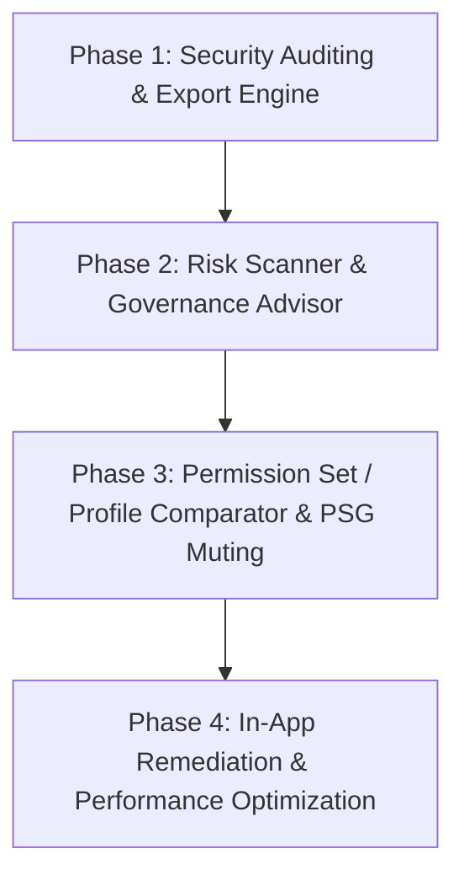

# Production Roadmap: Salesforce Permissions & Security Governance Suite

## Executive Vision
Transform the Salesforce Permissions Application from an internal utility into an **enterprise-grade, production-ready Security, Auditing, and Governance Suite**. The application enables Salesforce Administrators, Security Analysts, and Compliance Auditors to inspect, compare, audit, analyze, and remediate permissions and record-level access across any Salesforce org.

---

## Phased Release Schedule

---

## Phase 1: Security Auditing ("Who Has Access?") & Universal Export Engine

### Objectives
Provide instant reverse-lookup capabilities for auditors to identify everyone who has access to sensitive objects, fields, classes, or administrative system permissions, along with compliance export capabilities.

### Key Deliverables
1. **Reverse Permission Lookup ("Who Has Access?")**:
   - **Permission Category Selector**:
     - Object CRUD & FLS (e.g. Read/Create/Edit/Delete/View All/Modify All on `Account`, `Opportunity`, etc.)
     - Critical Field Level Security (FLS) (e.g. `Opportunity.Amount`, `Contact.SSN__c`)
     - System Permissions (e.g. `Modify All Data`, `View All Data`, `Author Apex`, `Manage Users`)
     - Apex Classes & Visualforce Pages
     - Flow Execution & Custom Metadata Types
   - **Audit Results Grid**:
     - List of all Users holding the permission.
     - Origin breakdown: Profile, Assigned Permission Sets, or Permission Set Groups.
     - User metadata: Active status, Title, Department, Last Login, Profile name.
     - Filter by active users, user profile, and department.
2. **Universal Export Engine**:
   - One-click CSV / Excel export on all app views:
     - "My Permissions" Effective View export.
     - "Compare Users" Side-by-side diff export.
     - "Record Access" Matrix & detailed sharing explanation export.
     - "Who Has Access?" Audit list export.
   - Compliance formatting suitable for SOC2, ISO27001, and SOX audit packages.

### Architecture & Components
- **Apex**: `WhoHasAccessController.cls`, `WhoHasAccessControllerTest.cls`
- **LWC**: `c/whoHasAccess`, `c/csvExportUtil`
- **Metadata**: Custom Tab `Who_Has_Access`, FlexiPage `Who_Has_Access`

---

## Phase 2: Security Health, Risk Scanner & Governance Advisor

### Objectives
Proactively scan the org for permission sprawl, dangerous privilege assignments, redundant permission sets, and security hygiene issues.

### Key Deliverables
1. **Critical & High-Risk Privilege Scanner**:
   - Automated detection of high-risk permissions assigned to non-admin profiles/users:
     - `PermissionsModifyAllData`, `PermissionsViewAllData`
     - `PermissionsAuthorApex`, `PermissionsCustomizeApplication`
     - `PermissionsManageUsers`, `PermissionsPasswordNeverExpires`
     - `PermissionsExportReports`, `PermissionsApiEnabled`
   - Visual dashboard: Risk gauge, count of high-risk users, severity levels (Critical / High / Medium).
2. **Hygiene & Redundancy Inspector**:
   - **Dormant Permission Sets**: List active Permission Sets with 0 active user assignments.
   - **Redundant Assignments**: Identify users where a Permission Set grants permissions already provided by their base Profile.
   - **Deactivated User Assignments**: Identify inactive users still holding sensitive permission sets.

### Architecture & Components
- **Apex**: `SecurityAdvisorController.cls`, `SecurityAdvisorControllerTest.cls`
- **LWC**: `c/securityAdvisor` (cards, badges, risk meters)
- **Metadata**: Custom Tab `Security_Advisor`, FlexiPage `Security_Advisor`

---

## Phase 3: Permission Set & Profile Comparator & PSG Muting Inspector

### Objectives
Empower administrators to refactor legacy Profiles into modern Permission Sets and Permission Set Groups (supporting Salesforce's profile end-of-life roadmap).

### Key Deliverables
1. **Direct Profile & Permission Set Comparator**:
   - Compare Profile vs Profile.
   - Compare Permission Set vs Permission Set.
   - Compare Permission Set Group vs Permission Set Group.
   - Visual side-by-side diff indicating Shared, Left-Only, and Right-Only permissions.
2. **Permission Set Group (PSG) & Muting Inspector**:
   - Visual breakdown of bundled Permission Sets inside a PSG.
   - Detailed display of **Muting Permission Set** effects (explicitly displaying what was allowed by the constituent sets but muted for the group).

### Architecture & Components
- **Apex**: `PermissionComparatorController.cls`, `PermissionComparatorControllerTest.cls`
- **LWC**: `c/permissionComparator`, `c/psgMutingViewer`
- **Metadata**: Custom Tab `Permission_Comparator`, FlexiPage `Permission_Comparator`

---

## Phase 4: In-App Remediation & Performance Optimization

### Objectives
Turn insights into action by letting administrators fix access directly from the UI, while optimizing performance for large-scale enterprise orgs.

### Key Deliverables
1. **Direct Remediation from Record Access**:
   - "Grant Manual Share" modal from the Record Access grid when a user lacks needed access.
   - "Revoke Share" action for explicit manual shares.
   - Deep-links directly to standard Salesforce Setup record sharing and user management pages.
2. **Platform Cache & Scalability**:
   - Leverage Salesforce Platform Cache (Org Cache) to cache Global Describe and object describes.
   - Virtual scrolling / pagination for the Record Access matrix for orgs with hundreds of users.
   - Setup Audit Trail widget displaying permission modifications over the past 7 days.

---

## Implementation Standards & Production Requirements
- **Strictly No Jest**: All testing done via Apex test classes in Salesforce org with >= 85% coverage.
- **Apex Security**: Enforce `without sharing` where necessary for cross-user permission discovery, with proper input sanitization and parameterized queries.
- **SLDS Modern Design**: Consistent high-contrast status badges, responsive grid layouts, and SLDS design tokens.
- **Packaging & Deployment**: Automated deployment scripts and updated Permission Sets granting appropriate tab and Apex class access.
